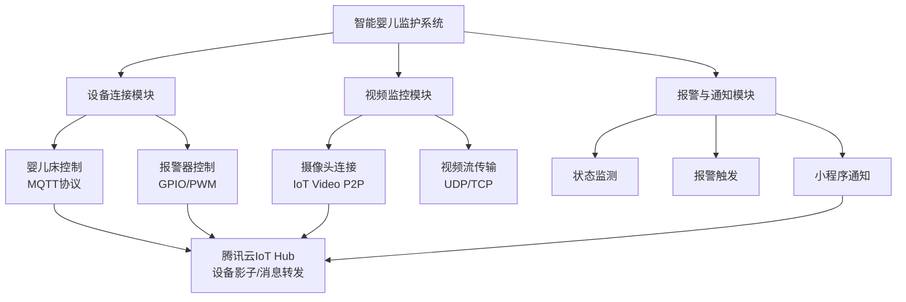

# 广泛定义

## IDP
>Indentity Provider 身份认真者
## SP
>Service Provider 服务提供者
## 用户
>通过登录IDP获取**身份断言**，并向SP返回**身份断言**来使用SP的服务

# SSO:Single Sign On
>允许用户使用一个账户登录不同的应用系统 
## 常用策略
- SAML2.0
- OAuth2.0
## 流程
![[Pasted image 20250821084522.png]]
# Protocol:协议
## SAML
>Security Assertion Markup Language
>基于XML的开放标准协议 用于在**IDP(身份提供者)与SP(服务提供者)**|之间交换认证和授权数据
![[Pasted image 20250821085332.png]]
# CAS
>Central Autentication Service
# OAuth
> 一种授权机制,数据平台同意授权第三方应用进入系统获取数据,于是产生短期可复用的进入**令牌(token)**
> 令牌短期内有效
> 令牌可被数据所有者撤销
> 令牌有权限范围
## 介绍文档
[OAuth 2.0 的一个简单解释 - 阮一峰的网络日志](https://www.ruanyifeng.com/blog/2019/04/oauth_design.html)

## 授权方式
>任何授权方式申请令牌前,都需要到系统备案,获取**客户端 ID/client ID和客户端密钥/client secret**
>无ID 与 密钥的第三方应用 不会拿到令牌

[OAuth 2.0 的四种方式 - 阮一峰的网络日志](https://www.ruanyifeng.com/blog/2019/04/oauth-grant-types.html)
### 授权码(authorization-code)
>前端负责传送授权码 后端存储令牌 由后端完成对资源服务器的通信
1. 第三方跳转至资源所有者 获取授权码
```http
https://b.com/oauth/authorize?
  response_type=code& //表示要求返回授权码
  client_id=CLIENT_ID& //备案时拿到的客户端ID
  redirect_uri=CALLBACK_URL& //后续目标跳转网页
  scope=read //授权权限范围

```
2. 资源所有者跳转回`redirect_uri`并传回授权码
```http
https://a.com/callback?code=AUTHORIZATION_CODE  //返回的授权码
```
3. 获取授权码后 由后端请求令牌
```http
https://b.com/oauth/token?
 client_id=CLIENT_ID&
 client_secret=CLIENT_SECRET& 
 // 备案信息 确认第三方身份
 grant_type=authorization_code& //采取的授权方式
 code=AUTHORIZATION_CODE& //授权码
 redirect_uri=CALLBACK_URL //令牌颁发后的回调网址

```
4. 向第三方的后端应用发送Json数据 包含令牌
```json
{    
  "access_token":"ACCESS_TOKEN",  //令牌
  "token_type":"bearer",
  "expires_in":2592000,
  "refresh_token":"REFRESH_TOKEN",
  "scope":"read",
  "uid":100101,
  "info":{...}
}
```

### 隐藏式(implicit)
>适用于纯前端应用 没有后端 令牌存储在前端
>令牌位于URL锚点(fragment) 而不是查询字符串(querystring)
>锚点不会发到服务器 减少令牌泄露风险
>存在中间人攻击
>有效期非常短 仅会话期间有效(浏览器关闭则失效)
1. 提供资源所有者理解
```http
https://b.com/oauth/authorize?
  response_type=token&  //要求直接返回token令牌
  client_id=CLIENT_ID&
  redirect_uri=CALLBACK_URL&
  scope=read
```
2. 资源所有者获取同意登录确认后 把token令牌作为URL参数传给第三方
```http
https://a.com/callback#token=ACCESS_TOKEN
```

### 密码式(password)
>在高度信任下
>允许第三方应用使用用户名密码申请令牌
>安全风险大
1. 使用用户名密码直接请求令牌
```http
https://oauth.b.com/token?
  grant_type=password&
  username=USERNAME&
  password=PASSWORD&
  client_id=CLIENT_ID
```
2. 直接给出令牌 不需要跳转 放入Json数据中作为响应返回
### 客户端凭证(client credentials)
>用于没有前端的命令行应用 在命令行下请求令牌
>返回的令牌适用于所有第三方应用 不局限于用户 可出现多个用户共享
1. 第三方在命令行发出请求
```http
https://oauth.b.com/token?
  grant_type=client_credentials&  //令牌策略
  client_id=CLIENT_ID& //备案id
  client_secret=CLIENT_SECRET //确认身份
```
2. 直接返回令牌
## 令牌使用
>请求头总添加`Authorization`字段存储令牌
```bash
curl -H "Authorization: Bearer ACCESS_TOKEN" \
"https://api.b.com"
```
## 令牌更新
>获取时一次获取两个令牌 令牌到期后 使用`refresh token`发送新请求 更新令牌
```http
https://b.com/oauth/token?
  grant_type=refresh_token& //表示更新令牌
  client_id=CLIENT_ID& 
  client_secret=CLIENT_SECRET&
  refresh_token=REFRESH_TOKEN  //用于凭证更新
```
# OIDC
>OpenID Connect


